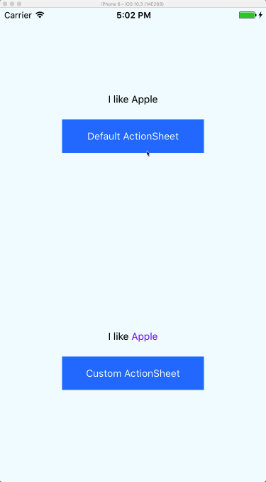
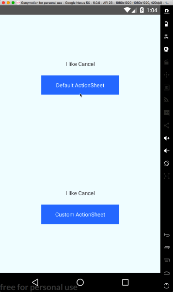

# react-native-custom-actionsheet
Cross platform ActionSheet. This component implements a custom ActionSheet and provides the same way of drawing it on the different platforms (iOS and Android). Actually, In order to keep the best effect, it still uses the ActionSheetIOS on iOS. For custom ActionSheet it uses different styles depending on the platform.

This project is based on [react-native-actionsheet](https://github.com/beefe/react-native-actionsheet) by [beefe](https://github.com/beefe).

 

# Installation

```
npm i -S react-native-custom-actionsheet
```

## Usage of ActionSheetCustom

so you can customize ActionSheet buttons

```javascript
import React, { Component } from 'react'
import { View, Text, StyleSheet } from 'react-native'
import { ActionSheetCustom as ActionSheet } from 'react-native-custom-actionsheet'

const CANCEL_INDEX = 0
const DESTRUCTIVE_INDEX = 4
const options = [
  'Cancel',
  'Apple',
  {
    component: <Text style={{ color: 'orange', fontSize: 24 }}>Banana</Text>,
    height: 80,
  },
  'Watermelon',
  {
    component: <Text style={{ color: 'blueviolet' }}>Apple</Text>,
    height: 40,
  },
]
const title = <Text style={{ color: 'crimson', fontSize: 18 }}>Which one do you like?</Text>

class CustomExample extends Component {
  state = {
    selected: 1,
  }

  showActionSheet = () => this.actionSheet.show()

  getActionSheetRef = ref => (this.actionSheet = ref)

  handlePress = index => this.setState({ selected: index })

  render() {
    const { selected } = this.state
    const selectedText = options[selected].component || options[selected]

    return (
      <View style={styles.wrapper}>
        <Text style={{ marginBottom: 20 }}>
          I like {selectedText}
        </Text>
        <Text style={styles.button} onPress={this.showActionSheet}>
          Custom ActionSheet
        </Text>
        <ActionSheet
          ref={this.getActionSheetRef}
          title={title}
          message="custom message custom message custom message custom message custom message custom message "
          options={options}
          cancelButtonIndex={CANCEL_INDEX}
          destructiveButtonIndex={DESTRUCTIVE_INDEX}
          onPress={this.handlePress}
        />
      </View>
    )
  }
}
```


## Usage

```javascript
import React from 'react'
import { View, Text, StyleSheet } from 'react-native'
import ActionSheet from 'react-native-custom-actionsheet'

const CANCEL_INDEX = 0
const DESTRUCTIVE_INDEX = 4
const options = [ 'Cancel', 'Apple', 'Banana', 'Watermelon', 'Durian' ]
const title = 'Which one do you like?'

class DefaultExample extends React.Component {
  state = {
    selected: '',
  }

  showActionSheet = () => this.actionSheet.show()

  getActionSheetRef = ref => (this.actionSheet = ref)

  handlePress = (index) => this.setState({ selected: index })

  render() {
    return (
      <View style={styles.wrapper}>
        <Text style={{marginBottom: 20}}>
          I like {options[this.state.selected]}
        </Text>
        <Text style={styles.button} onPress={this.showActionSheet}>
          Default ActionSheet
        </Text>
        <ActionSheet
          ref={this.getActionSheetRef}
          title={title}
          message="custom message custom message custom message custom message custom message custom message "
          options={options}
          cancelButtonIndex={CANCEL_INDEX}
          destructiveButtonIndex={DESTRUCTIVE_INDEX}
          onPress={this.handlePress}
        />
      </View>
    )
  }
}
```


## Props

<table>
    <tr>
        <th>Prop name</th>
        <th>Desciption</th>
        <th>Type</th>
        <th>Default</th>
    </tr>
    <tr>
        <td>title</td>
        <td></td>
        <td>PropTypes.string or PropTypes.element</td>
        <td></td>
    </tr>
    <tr>
        <td>message</td>
        <td></td>
        <td>PropTypes.string or PropTypes.element</td>
        <td></td>
    </tr>
    <tr>
        <td>options</td>
        <td></td>
        <td>
          PropTypes.arrayOf([
            PropTypes.string,
            PropTypes.shape({
              component: PropTypes.element,
              height: PropTypes.number
            }),
          ])
        </td>
        <td></td>
    </tr>
    <tr>
        <td>tintColor</td>
        <td></td>
        <td>PropTypes.string</td>
        <td></td>
    </tr>
    <tr>
        <td>cancelButtonIndex</td>
        <td></td>
        <td>PropTypes.number</td>
        <td></td>
    </tr>
    <tr>
        <td>destructiveButtonIndex</td>
        <td></td>
        <td>PropTypes.number</td>
        <td></td>
    </tr>
    <tr>
        <td>onPress</td>
        <td></td>
        <td>PropTypes.func</td>
        <td>(index) => {}</td>
    </tr>
    <tr>
        <td>styles</td>
        <td></td>
        <td>StyleSheet object with some keys from ./lib/styles</td>
        <td></td>
    </tr>
</table>
